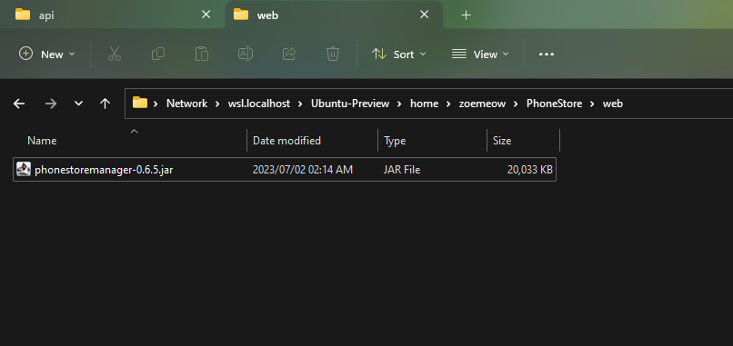

# Capstone Project

- Mọi thứ về đồ án cuối cùng
- Tên đồ án: **Xây dựng website cửa hàng bán điện thoại**.

# Công nghệ đã sử dụng

- Cơ sở dữ liệu: SQLite
- API: ASP.NET (dựa trên .NET 7)
- Web: Spring Boot (Java)

# Yêu cầu cần có

- API:
  - [ASP.NET SDK 7](https://dotnet.microsoft.com/en-us/download/dotnet/7.0).
  - [Visual Studio](https://visualstudio.microsoft.com/downloads/)
	- Đề xuất bản 2019 hoặc mới hơn.
	- Thêm gói ASP.NET khi cài đặt.
	- Chỉ cài khi cần build bằng giao diện (hoặc khó khăn khi build bằng dòng lệnh).
- Web:
  - Java JDK 17 [(ở đây sử dụng Eclipse Temurin)](https://adoptium.net/temurin/releases/).
  - [Apache Maven](https://maven.apache.org/download.cgi). Yêu cầu Java JDK.
- Triển khai lên server (ở đây sử dụng Linux):
  - [Java JRE 17](https://www.oracle.com/java/technologies/javase/jdk17-archive-downloads.html).
  - [ASP.NET runtime 7](https://dotnet.microsoft.com/en-us/download/dotnet/7.0).
  - Apache2 (cài đặt trên Linux sử dụng `sudo apt install apache2`).

# Các bước build chương trình

- API:
  - CD đến dự án API
	- ex. `cd /d D:\1\DATN-102190147-Source\src\api\`
  - Build dự án bằng dòng lệnh:
	- `dotnet publish -c Release -r win-x64 -p:PublishSingleFile=true -p:PublishTrimmed=true .\PhoneStoreManager.sln`
	  - `-r win-x64`: Build chương trình để chạy trên Windows 64-bit. Ví dụ: Linux 64-bit: `-r linux-x64`.
	  - `-p:PublishSingleFile=true`: Build chương trình để tạo ra một file thực thi thay vì sao chép các thư viện như build truyền thống.
	  - `-p:PublishTrimmed=true`: Loại bỏ code không sử dụng đến trong thư viện để file thực thi nhẹ hơn.
  - Sau khi build thành công, bạn có thể sử dụng file trong `(thư mục dự án API)\bin\Release\net7.0\win-x64\publish` (với win-x64) để triển khai lên server.
- Web:
  - CD đến dự án Web
	- ex. `cd /d D:\1\DATN-102190147-Source\src\web\`
  - Build dự án bằng dòng lệnh :
	- `mvn clean dependency:resolve install package`
  - Sau khi build thành công, bạn có thể sử dụng file .jar trong `(thư mục dự án Web)\target` để triển khai lên server.

# Các bước triển khai chương trình

- Bước 1: Tạo và chạy thử chương trình:
  - Tải lên tất cả file [được build ở bước trước](#step-by-step-build-program) lên server. Để quản lý chương trình tốt hơn, hãy tải lên file theo cấu trúc:
    - `~/PhoneStore/api/...` (cho API)
    - `~/PhoneStore/web/...` (cho Web)
  - Sau khi tải lên, nó sẽ trông như thế này:
    - 
    - 
  - Cấp quyền thực thi cho API bằng câu lệnh: `chmod +x ~/PhoneStore/api/PhoneStoreManager`
  - Sau đó có thể thử thực hiện các lệnh này để kiểm tra ứng dụng trước khi đến bước tiếp theo:
	- `~/PhoneStore/api/PhoneStoreManager`
	- `java -jar ~/PhoneStore/web/phonestoremanager-0.6.5.jar` (bạn có thể cần thay thế đường dẫn này thành đường dẫn jar trên máy chủ của mình).

- Bước 2: Tạo service để tự khởi động khi khởi động hệ thống:
  - Tạo file /etc/systemd/system với các cấu hình dưới đây:
	- /etc/systemd/system/phonestore-api.service:
	```
	[Unit]
	Description=Phone Store service - Web
	After=network.target
	
	[Service]
	Type=simple
	User=zoemeow
	Group=zoemeow
	Restart=always
	WorkingDirectory=/home/zoemeow/PhoneStore/api
	ExecStart=/home/zoemeow/PhoneStore/api/PhoneStoreManager
	
	[Install]
	WantedBy=multi-user.target
	```
	- /etc/systemd/system/phonestore-web.service
	```
	Description=Phone Store service - API
	After=network.target
	
	[Service]
	Type=simple
	User=zoemeow
	Group=zoemeow
	Restart=always
	ExecStart=java -jar /home/zoemeow/PhoneStore/web/phonestoremanager-0.6.5.jar
	Environment="PAYPAL_CLIENTID_SANDBOX="
	Environment="PAYPAL_CLIENTID_LIVE="
	[Install]
	WantedBy=multi-user.target
	```
	
  - Thêm PayPal Client ID của bạn vào PAYPAL_CLIENT_ID_SANBOX (hoặc PAYPAL_CLIENT_LIVE nếu bạn có một ứng dụng hoạt động trực tiếp). Về Client ID, hãy đến [PayPal developer](https://developer.paypal.com/).
  - Bạn có thể cần thay thế lệnh ExecStart trong service API và Web bằng lệnh bạn đã kiểm tra ở bước trước.
  - Thay thế User và Group service API và Web với User và Group của bạn trong server (sử dụng lệnh `id` để kiểm tra).
  - Tải lại, kích hoạt và bắt đầu service:
	``` sh
	sudo systemctl daemon-reload
	sudo systemctl enable phonestore-api
	sudo systemctl enable phonestore-web
	sudo systemctl start phonestore-api
	sudo systemctl start phonestore-web
	```

- Bước 3: Sử dụng apache2 để tạo virtualhost
  - Chỉnh sửa tệp trong apache2 bằng cách thêm các dòng sau theo mẫu bên dưới:
	- /etc/apache2/sites-available/000-default.conf
	```
	<VirtualHost *:80>
	...
		ProxyPreserveHost Off
		ProxyPass /api/ http://localhost:5000/
		ProxyPassReverse /api/ http://localhost:5000/
		ProxyPass / http://localhost:5002/
		ProxyPassReverse / http://localhost:5002/
	...	
	</VirtualHost>
	```
	- /etc/apache2/sites-available/default-ssl.conf
	```
	<VirtualHost *:443>
		...
		ProxyPreserveHost Off
        ProxyPass /api/ http://localhost:5000/
        ProxyPassReverse /api/ http://localhost:5000/
        ProxyPass / http://localhost:5002/
        ProxyPassReverse / http://localhost:5002/
		...
	</VirtualHost>
	```
	- Lưu ý: bạn có thể cần phải tự cấu hình SSL (bạn có thể theo dõi [bài viết này](https://www.digicert.com/kb/csr-ssl-installation/ubuntu-server-with-apache2-openssl.htm) để thử nghiệm).
  - Kích hoạt mod và site bằng các lệnh này:
	```sh
	sudo a2enmod ssl
	sudo a2enmod proxy_http
	sudo a2ensite 000-default
	sudo a2ensite default-ssl
	```
  - Kiểm tra cấu hình bằng câu lệnh: `sudo apachectl configtest`. Nếu trả về: `Syntax OK`, bạn đã cấu hình đúng quy tắc của apache2.
  - Reload service apache2 với câu lệnh này: `sudo systemctl restart apache2`.

- Bạn có thể cần bật cổng http và https với câu lệnh sau:
  ```sh
  sudo ufw allow http
  sudo ufw allow https
  ```

- BÂY GIỜ bạn có thể kiểm tra trang web của mình với ip server của bạn.

# Lưu ý
- Cơ sở dữ liệu sẽ được khởi tạo khi bắt đầu PhoneStore API (sử dụng SQLite), bạn có thể bỏ qua tệp .sql ở trong thư mục.
