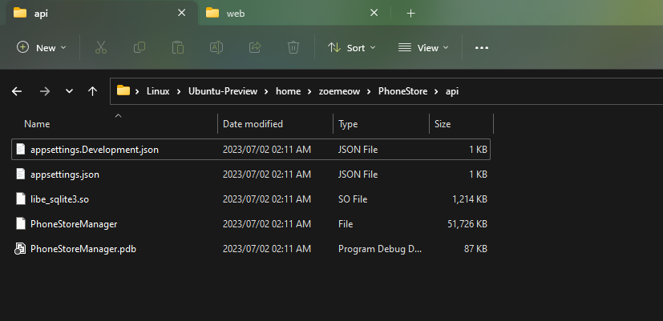
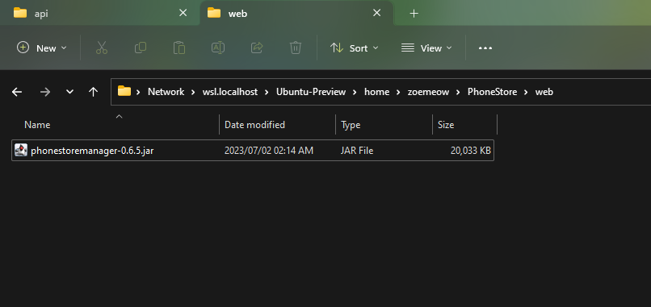

# Capstone Project

- Everything about my final project in DUT.
- Project name: **Phone store manager**.

# Used technologies

- Database: SQLite
- API: ASP.NET (based on .NET 7)
- Web: Spring Boot (Java)

# Requirements

- For API:
  - [ASP.NET SDK 7](https://dotnet.microsoft.com/en-us/download/dotnet/7.0).
  - [Visual Studio](https://visualstudio.microsoft.com/downloads/)
	- Recommend 2019 or later.
	- Include ASP.NET package when install.
	- If you really need build with GUI.
- For Web:
  - Java JDK 17 [(i'm using Eclipse Temurin)](https://adoptium.net/temurin/releases/).
  - [Apache Maven](https://maven.apache.org/download.cgi). Note that requires Java JDK.
- For server to deploy (i'm using Linux):
  - [Java JRE 17](https://www.oracle.com/java/technologies/javase/jdk17-archive-downloads.html).
  - [ASP.NET runtime 7](https://dotnet.microsoft.com/en-us/download/dotnet/7.0).
  - Apache2 (install in Linux with `sudo apt install apache2`).

# Step-by-step build program

- API:
  - CD to API project
	- ex. `cd /d D:\1\DATN-102190147-Source\src\api\`
  - Build project using this command:
	- `dotnet publish -c Release -r win-x64 -p:PublishSingleFile=true -p:PublishTrimmed=true .\PhoneStoreManager.sln`
	  - `-r win-x64`: Build application run with Windows 64-bit. For example: Linux 64-bit: `-r linux-x64`.
	  - `-p:PublishSingleFile=true`: Build application with single excutable file instead of bundle files.
	  - `-p:PublishTrimmed=true`: Trim any unused library to reduce application size.
  - After successfully building, you can use file in `(api project folder)\bin\Release\net7.0\win-x64\publish` (for win-x64) for deploy to server.
- Web:
  - CD to Web project
	- ex. `cd /d D:\1\DATN-102190147-Source\src\web\`
  - Build project using this command:
	- `mvn clean dependency:resolve install package`
  - After successfully building, you can use .jar file in `(web project folder)\target` for deploy to server.

# Step-by-step deploy to server

- Step 1: Create and run application on server:
  - Upload all files [built in previous step](#step-by-step-build-program) to server. For manage application easily, let's upload binary with:
    - `~/PhoneStore/api/...` (for API)
    - `~/PhoneStore/web/...` (for Web)
  - After upload, it looks like this:
    - 
    - 
  - Grant execute permission on API with this command: `chmod +x ~/PhoneStore/api/PhoneStoreManager`
  - After that, you can try to execute these commands to test application before next step:
	- `~/PhoneStore/api/PhoneStoreManager`
	- `java -jar ~/PhoneStore/web/phonestoremanager-0.6.5.jar` (you might need to replace this path to jar path on your server).

- Step 2: Create service to auto start at system start:
  - Create file in /etc/systemd/system with these configurations below:
	- /etc/systemd/system/phonestore-api.service:
	```
	[Unit]
	Description=Phone Store service - Web
	After=network.target
	
	[Service]
	Type=simple
	User=zoemeow
	Group=zoemeow
	Restart=always
	WorkingDirectory=/home/zoemeow/PhoneStore/api
	ExecStart=/home/zoemeow/PhoneStore/api/PhoneStoreManager
	
	[Install]
	WantedBy=multi-user.target
	```
	- /etc/systemd/system/phonestore-web.service
	```
	Description=Phone Store service - API
	After=network.target
	
	[Service]
	Type=simple
	User=zoemeow
	Group=zoemeow
	Restart=always
	ExecStart=java -jar /home/zoemeow/PhoneStore/web/phonestoremanager-0.6.5.jar
	Environment="PAYPAL_CLIENTID_SANDBOX="
	Environment="PAYPAL_CLIENTID_LIVE="
	[Install]
	WantedBy=multi-user.target
	```
	
  - Add your PayPal client id in PAYPAL_CLIENT_ID_SANBOX (or PAYPAL_CLIENT_LIVE if you have an application working with live). For Client ID, navigate to [PayPal developer](https://developer.paypal.com/).
  - You might need to replace ExecStart command in API and Web service with command you have tested in previous step.
  - Replace User and Group in API and Web service with your user and your group in server (use command `id` for more information).
  - Reload, enable and start service with:
	``` sh
	sudo systemctl daemon-reload
	sudo systemctl enable phonestore-api
	sudo systemctl enable phonestore-web
	sudo systemctl start phonestore-api
	sudo systemctl start phonestore-web
	```

- Step 3: Use apache2 to create virtualhost
  - Edit file in apache2 by adding lines following below:
	- /etc/apache2/sites-available/000-default.conf
	```
	<VirtualHost *:80>
	...
		ProxyPreserveHost Off
		ProxyPass /api/ http://localhost:5000/
		ProxyPassReverse /api/ http://localhost:5000/
		ProxyPass / http://localhost:5002/
		ProxyPassReverse / http://localhost:5002/
	...	
	</VirtualHost>
	```
	- /etc/apache2/sites-available/default-ssl.conf
	```
	<VirtualHost *:443>
		...
		ProxyPreserveHost Off
        ProxyPass /api/ http://localhost:5000/
        ProxyPassReverse /api/ http://localhost:5000/
        ProxyPass / http://localhost:5002/
        ProxyPassReverse / http://localhost:5002/
		...
	</VirtualHost>
	```
	- Note: you might need to config SSL your self (you can follow [this article](https://www.digicert.com/kb/csr-ssl-installation/ubuntu-server-with-apache2-openssl.htm) for temporary).
  - Enable mod and site with these commands:
	```sh
	sudo a2enmod ssl
	sudo a2enmod proxy_http
	sudo a2ensite 000-default
	sudo a2ensite default-ssl
	```
  - Test config with this command: `sudo apachectl configtest`. If returns: `Syntax OK`, you have configured correctly.
  - Reload apache2 with this command: `sudo systemctl restart apache2`.

- You might need to enable http and https port with:
  ```sh
  sudo ufw allow http
  sudo ufw allow https
  ```

- NOW you can test your website with your server ip.

# Note
- Database can initialized when start PhoneStore API (as it use SQLite), you can ignore .sql file.
